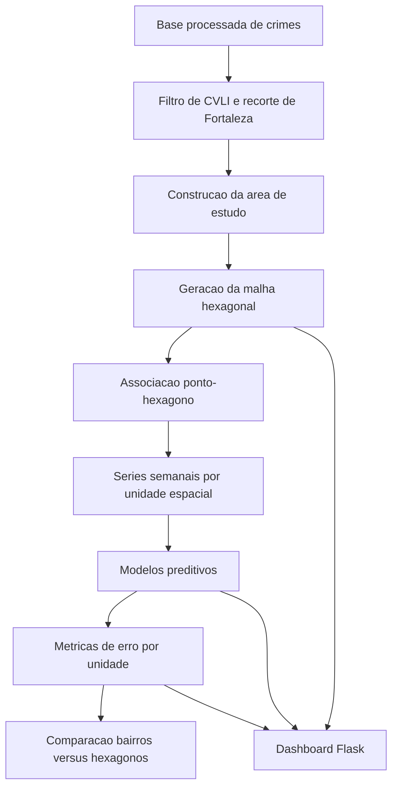

# Documentacao Academica da Plataforma de Predicao Espaco-Temporal de CVLI

- Projeto: `Crime_Predict-Algoritmo Genetico`
- Data de referencia desta documentacao: `2026-06-10`
- Escopo: descrever a plataforma de forma explicavel em linguagem academica, cobrindo dados, formulacao espacial, algoritmo genetico, metricas de erro, protocolo experimental, resultados e arquitetura do aplicativo.

---

## 1. Visao geral do problema

O projeto investiga a previsao semanal de eventos de CVLI em Fortaleza/CE por meio de uma abordagem espaco-temporal. A proposta central e substituir, ou pelo menos confrontar, a divisao administrativa tradicional por bairros com uma discretizacao espacial regular baseada em hexagonos otimizados.

A pergunta metodologica principal e:

> Uma malha hexagonal regular, otimizada por algoritmo genetico e avaliada sob protocolo temporal rigoroso, produz desempenho preditivo superior ao particionamento por bairros?

Para responder a essa pergunta, a plataforma foi estruturada em quatro camadas:

1. preparacao e filtragem dos dados;
2. construcao da representacao espacial;
3. modelagem preditiva semanal por unidade espacial;
4. visualizacao e explicacao dos resultados em uma interface web.

---

## 2. Objetivo cientifico da plataforma

Sob o ponto de vista academico, a plataforma nao e apenas um dashboard. Ela funciona como um ambiente experimental reproduzivel para:

1. definir unidades espaciais de analise;
2. transformar eventos pontuais em series temporais semanais;
3. comparar modelos sob uma mesma divisao treino-teste;
4. medir erro por unidade espacial;
5. consolidar resultados para subsidiar conclusoes do mestrado.

Assim, a interface Flask atua como camada de interpretabilidade e inspecao, enquanto o nucleo cientifico reside nos scripts de preparacao, no gerador de malha, no algoritmo genetico e no protocolo de avaliacao.

---

## 3. Base de dados e recorte analitico

### 3.1 Fonte processada

A plataforma trabalha prioritariamente com a base:

- `data/processed/fortaleza_crimes_normalizado.csv`

com fallback para:

- `data/processed/fortaleza_crimes.csv`

O carregamento efetivo ocorre por `src/spatial_utils.py`, e a aplicacao web consome essa base via `src/dashboard_service.py`.

### 3.2 Evento de interesse

O estudo foi restringido a eventos classificados como CVLI. Formalmente, se o conjunto original de registros for denotado por:

\[
\mathcal{D} = \{r_1, r_2, \dots, r_n\}
\]

o subconjunto utilizado no estudo e:

\[
\mathcal{D}_{CVLI} = \{r_i \in \mathcal{D} : tipo(r_i) = CVLI\}
\]

Na implementacao, quando a coluna `tipo` nao esta disponivel, o sistema utiliza equivalencias textuais em colunas alternativas para preservar o mesmo conceito substantivo de evento letal intencional.

### 3.3 Recorte espacial

Depois do filtro por natureza do evento, a base e restringida a Fortaleza. O fluxo atual combina:

1. filtragem geografica inicial por coordenadas;
2. eliminacao de pontos espurios;
3. inferencia de uma area de estudo a partir da nuvem espacial observada.

Sejam os pontos geograficos:

\[
P = \{(lon_i, lat_i)\}_{i=1}^{N}
\]

o sistema constroi uma area de estudo \(A_{estudo}\) que recorta a malha hexagonal para evitar expansoes artificiais fora do territorio relevante.

Essa decisao e importante academicamente: a malha nao e gerada sobre uma caixa infinita, mas sobre um recorte espacial derivado da distribuicao empirica dos eventos.

---

## 4. Plataforma como sistema explicavel

Do ponto de vista arquitetural, a plataforma pode ser representada pelo fluxo:

Isso torna o aplicativo explicavel em termos de encadeamento logico:

1. cada ponto observado entra no sistema como ocorrencia georreferenciada;
2. cada ocorrencia e atribuida a uma unidade espacial;
3. cada unidade espacial gera uma serie temporal semanal;
4. cada serie produz previsoes;
5. cada previsao e confrontada com os valores observados;
6. o erro resultante orienta a avaliacao cientifica e a visualizacao no app.

---

## 5. Formulacao da malha hexagonal

### 5.1 Parametrizacao genetica

Cada individuo do algoritmo genetico e um vetor:

\[
g = (dx, dy, \theta, R)
\]

em que:

- \(dx\): deslocamento horizontal relativo;
- \(dy\): deslocamento vertical relativo;
- \(\theta\): rotacao da malha;
- \(R\): raio do hexagono regular.

Os limites observados no codigo sao:

\[
dx \in [0, 1], \quad dy \in [0, 1], \quad \theta \in [0, \pi/3], \quad R \in [0.0075, 0.03]
\]

### 5.2 Geometria do hexagono regular

Para um hexagono regular de raio \(R\):

\[
w = 2R
\]

\[
h = \sqrt{3}R
\]

\[
\Delta x = 1.5R
\]

\[
\Delta y = \sqrt{3}R
\]

com deslocamento vertical adicional de \(\Delta y/2\) em colunas alternadas.

A area do hexagono e:

\[
A_{hex} = \frac{3\sqrt{3}}{2}R^2
\]

Logo, o crescimento de \(R\) amplia quadraticamente a area de cada celula e tende a reduzir o numero total de hexagonos necessarios para cobrir a regiao.

### 5.3 Rotacao da malha

Cada vertice e rotacionado em torno do centro \((c_x, c_y)\) da area de referencia:

\[
x' = \cos(\theta)(x-c_x) - \sin(\theta)(y-c_y) + c_x
\]

\[
y' = \sin(\theta)(x-c_x) + \cos(\theta)(y-c_y) + c_y
\]

Esse passo permite que a malha se adapte melhor a orientacao empirica do territorio e da distribuicao dos eventos.

### 5.4 Associacao entre ocorrencias e hexagonos

Depois de gerada a malha, cada ocorrencia pontual \(p_i\) e mapeada para um hexagono \(h_j\):

\[
f(p_i) = h_j
\]

Se um ponto nao pertence a nenhum poligono valido apos o recorte, ele e descartado no experimento hexagonal:

\[
f(p_i) = -1
\]

Na implementacao, essa etapa usa indexacao espacial com `STRtree`, o que reduz o custo de consulta geometrica.

---

## 6. Algoritmo genetico de escolha dos hexagonos

### 6.1 Objetivo da otimizacao

O algoritmo genetico nao procura "o hexagono ideal" isoladamente, mas a configuracao global da malha que minimiza o erro de previsao semanal apos a agregacao espacial.

Em termos formais, busca-se:

\[
g^* = \arg\min_{g \in \mathcal{G}} EQM_{pen}(g)
\]

onde \(\mathcal{G}\) e o espaco das configuracoes admissiveis e \(EQM_{pen}\) e o erro quadratico medio penalizado.

### 6.2 Etapas de avaliacao de um individuo

Para cada individuo \(g\), o sistema executa:

1. geracao da malha hexagonal;
2. atribuicao das ocorrencias aos hexagonos;
3. agregacao semanal por `hex_id`;
4. construcao das variaveis defasadas;
5. treino do modelo base de avaliacao;
6. calculo do erro;
7. aplicacao da penalizacao por desvio do numero-alvo de hexagonos.

### 6.3 Erro quadratico medio

Sejam \(y_k\) os valores observados e \(\hat{y}_k\) os valores previstos. O erro quadratico medio e dado por:

\[
EQM = \frac{1}{m}\sum_{k=1}^{m}(y_k - \hat{y}_k)^2
\]

Essa formula aparece no projeto tanto como criterio direto de comparacao quanto como base da funcao de aptidao.

### 6.4 Erro absoluto medio

Como medida complementar, o projeto tambem utiliza o erro absoluto medio:

\[
EAM = \frac{1}{m}\sum_{k=1}^{m}|y_k - \hat{y}_k|
\]

O EQM tem maior sensibilidade a erros grandes, enquanto o EAM fornece leitura mais robusta da magnitude media do desvio.

### 6.5 Penalizacao pelo numero de hexagonos

O algoritmo nao otimiza apenas erro puro. Ele tambem controla a complexidade espacial da malha.

Se \(N_{hex}\) e o numero de hexagonos criados e \(N_{alvo}\) o numero desejado, define-se:

\[
\delta_{hex} = \frac{|N_{hex} - N_{alvo}|}{\max(N_{alvo}, 1)}
\]

e entao:

\[
EQM_{pen} = EQM + \lambda \cdot \delta_{hex}
\]

em que \(\lambda\) corresponde ao parametro `hex_penalty_weight`.

Interpretativamente, essa parcela evita que a melhor solucao seja trivialmente uma malha excessivamente fragmentada ou excessivamente grosseira.

### 6.6 Funcao de aptidao

A aptidao e definida por:

\[
fitness(g) = \frac{1}{EQM_{pen}(g) + 10^{-8}}
\]

Portanto, maximizar `fitness` equivale a minimizar o erro penalizado.

### 6.7 Operadores geneticos

O nucleo genetico implementa:

1. selecao por torneio com 3 candidatos;
2. crossover aritmetico com \(\alpha \in [0.1, 0.9]\);
3. mutacao gaussiana com intensidade decrescente ao longo das geracoes;
4. elitismo, preservando o melhor individuo da geracao anterior.

A intensidade de mutacao segue:

\[
\sigma_t = 0.1 \left(1 - \frac{t}{T}\right)
\]

onde \(t\) e a geracao corrente e \(T\) e o total de geracoes.

Essa escolha introduz mais exploracao nas primeiras iteracoes e mais refinamento nas ultimas.

---

## 7. Melhor configuracao hexagonal encontrada

O arquivo `data/processed/best_hex_grid.json` registra a melhor configuracao persistida no repositorio:

\[
dx = 0.8324426408004217
\]

\[
dy = 0.21233911067827616
\]

\[
\theta = 0.19040666040567744
\]

\[
R = 0.00935615945025577
\]

com os seguintes indicadores associados:

- `best_mse = 0.053355945323510956`
- `penalized_mse = 0.328355945323511`
- `hex_count = 133`
- `active_hex_count = 125`
- `target_hex_count = 140`

Esses valores mostram que a solucao escolhida nao e avaliada apenas pela precisao, mas por um equilibrio entre desempenho e granularidade espacial.

---

## 8. Construcao das series temporais

### 8.1 Agregacao semanal

Para cada unidade espacial \(u\), seja bairro ou hexagono, a plataforma constroi uma serie:

\[
Y_u = \{y_{u,t}\}_{t=1}^{T}
\]

na qual \(y_{u,t}\) representa a contagem semanal de eventos.

A semana utilizada no codigo e a semana civil ancorada no inicio do periodo semanal.

### 8.2 Preenchimento de semanas ausentes

Para evitar descontinuidades, o sistema constroi o produto cartesiano entre:

1. todas as semanas do intervalo observado;
2. todas as unidades espaciais presentes.

Assim, semanas sem ocorrencias sao explicitamente preenchidas com zero:

\[
y_{u,t} = 0 \quad \text{se nao houver evento registrado naquela semana}
\]

Essa decisao e metodologicamente importante, pois distingue ausencia de evento de ausencia de observacao.

### 8.3 Variaveis explicativas

Para cada observacao semanal, a plataforma gera as seguintes features:

1. `lag_1`, `lag_2`, `lag_3`
2. `media_movel_4`
3. `tendencia_1`
4. `semana_ano`
5. `mes`

Formalmente:

\[
lag_k(t) = y_{t-k}
\]

\[
media\_movel\_4(t) = \frac{1}{4}\sum_{r=1}^{4} y_{t-r}
\]

\[
tendencia\_1(t) = y_{t-1} - y_{t-2}
\]

Essas variaveis incorporam memoria temporal curta, suavizacao local e sazonalidade calendario.

---

## 9. Protocolo experimental do orientador

O protocolo implementado no repositorio, refletido em `src/experiment_protocol.py`, pode ser resumido em cinco passos.

### 9.1 Selecao de unidades com 95% de cobertura

As unidades espaciais sao ordenadas por volume total de eventos. Seja \(c_u\) a contagem de eventos da unidade \(u\), e seja:

\[
s_u = \frac{c_u}{\sum_v c_v}
\]

a participacao relativa dessa unidade.

Calcula-se a cobertura acumulada:

\[
S_k = \sum_{i=1}^{k} s_{(i)}
\]

onde \((i)\) denota a ordem decrescente por contagem.

Seleciona-se o menor conjunto de unidades tal que a cobertura acumulada atinja pelo menos 95%:

\[
\mathcal{U}_{0.95} = \min \left\{ \mathcal{U}' : \sum_{u \in \mathcal{U}'} c_u \geq 0.95 \sum_v c_v \right\}
\]

Essa etapa reduz o peso de unidades muito raras e torna a comparacao mais estavel.

### 9.2 Divisao temporal treino-teste

O ponto de corte utilizado nos experimentos formais e:

- `2025-12-31`

Logo:

\[
Treino = \{t : t \leq 2025\text{-}12\text{-}31\}
\]

\[
Teste = \{t : t > 2025\text{-}12\text{-}31\}
\]

Isso preserva a causalidade temporal e evita vazamento de informacao futura para o treinamento.

### 9.3 Avaliacao por unidade espacial

Um ponto central da metodologia e que os erros sao computados por unidade espacial e depois resumidos. Nao se trata de avaliar apenas uma soma global agregada.

Se \(u\) representa uma unidade espacial, o erro por unidade e:

\[
EQM_u = \frac{1}{m_u}\sum_{t \in Teste}(y_{u,t} - \hat{y}_{u,t})^2
\]

\[
EAM_u = \frac{1}{m_u}\sum_{t \in Teste}|y_{u,t} - \hat{y}_{u,t}|
\]

e a comparacao final usa medias entre unidades:

\[
\overline{EQM} = \frac{1}{|\mathcal{U}_{0.95}|}\sum_{u \in \mathcal{U}_{0.95}} EQM_u
\]

\[
\overline{EAM} = \frac{1}{|\mathcal{U}_{0.95}|}\sum_{u \in \mathcal{U}_{0.95}} EAM_u
\]

### 9.4 Modelos avaliados na fase 1

Os experimentos formais de primeira fase comparam:

- `naive_lag1`
- `linear_regression`
- `ridge`
- `poisson`

### 9.5 Modelos avaliados na fase 2

Na segunda fase, com `skforecast`, foram avaliados:

- `linear_regression`
- `ridge`
- `poisson`
- `hist_gradient_boosting`

A estrategia registrada nos artefatos e `ForecasterRecursive`.

---

## 10. Resultados formais do baseline por bairros

Conforme `data/processed/baseline_bairros_95_summary.json`, o baseline por bairros apresentou:

- `selected_regions = 86`
- `total_events = 3095`
- `filtered_events = 2947`
- `achieved_coverage = 0.9521809369951535`
- `best_model = poisson`
- `mse_mean = 0.08178094248722134`
- `mae_mean = 0.18759423965775543`

Interpretacao academica:

1. o particionamento administrativo por bairros possui desempenho competitivo;
2. a regressao de Poisson e coerente com a natureza de contagem da variavel-resposta;
3. a selecao de 86 bairros reteve aproximadamente 95.22% dos eventos observados.

---

## 11. Resultados formais do experimento por hexagonos

Conforme `data/processed/experimento_hexagonos_95_summary.json`, o experimento hexagonal apresentou:

- `selected_regions = 94`
- `total_events = 3095`
- `filtered_events = 2946`
- `achieved_coverage = 0.9518578352180938`
- `best_model = poisson`
- `mse_mean = 0.07751943488650911`
- `mae_mean = 0.17873288596368284`

Em comparacao com o baseline por bairros, a malha hexagonal produziu erro medio inferior tanto em EQM quanto em EAM na fase 1. Isso sustenta a hipotese de que uma discretizacao espacial regular e orientada por desempenho pode representar melhor a dinamica local dos eventos do que limites administrativos fixos.

---

## 12. Segunda fase com skforecast

### 12.1 Bairros

Conforme `data/processed/fase2_skforecast_bairros_95_summary.json`:

- `best_model = poisson`
- `mse_mean = 0.0820414900219195`
- `mae_mean = 0.18715004684906963`

### 12.2 Hexagonos

Conforme `data/processed/fase2_skforecast_hexagonos_95_summary.json`:

- `best_model = hist_gradient_boosting`
- `mse_mean = 0.07417820881158137`
- `mae_mean = 0.17041728671419476`

### 12.3 Leitura metodologica

Os resultados da fase 2 reforcam a superioridade empirica da representacao hexagonal neste repositorio, pois:

1. a cobertura permaneceu comparavel a da fase 1;
2. a divisao treino-teste foi preservada;
3. a melhor configuracao global passou a ser `fase2_skforecast_hexagonos_95`;
4. a melhora em relacao aos bairros permaneceu mesmo com outra familia de modelos.

---

## 13. Arquitetura do aplicativo Flask

### 13.1 Papel do app

O arquivo `app.py` organiza a camada de apresentacao. Academicamente, ele nao redefine o metodo; ele expone, de forma auditavel, os resultados da cadeia analitica.

### 13.2 Rotas principais

O aplicativo possui duas rotas centrais:

1. `/`
2. `/relatorio`

A rota `/` renderiza o painel interativo principal. Quando recebe `partial=1`, ela retorna um objeto JSON com:

- `map_html`
- `error`
- `from_cache`
- `metrics`

Isso permite atualizacao incremental da interface sem recomputar a pagina inteira.

A rota `/relatorio` monta uma visao textual de relatorio, adequada para inspecao e apresentacao dos resultados derivados do filtro corrente.

### 13.3 Parametros controlados pelo usuario

O app permite modificar:

- bairros selecionados;
- data inicial;
- data final;
- tamanho da populacao do AG;
- numero de geracoes;
- ocultacao de hexagonos esparsos;
- exibicao de pontos CVLI.

Ou seja, o usuario nao altera a teoria do metodo, mas pode observar como a malha e as metricas se comportam sob diferentes recortes observacionais.

### 13.4 Metricas exibidas

Pela leitura de `src/dashboard_service.py`, a camada web sintetiza indicadores como:

- numero de registros;
- bairros ativos;
- AIS ativas;
- hexagonos ativos;
- hexagonos criados;
- hexagonos renderizados;
- hexagonos esparsos;
- `mse_hex`;
- `mse_bairros`;
- `mse_ais`.

Isso torna a plataforma defensavel em banca, porque a visualizacao nao mostra apenas mapa: ela explicita o efeito quantitativo das escolhas espaciais.

---

## 14. Explicabilidade do sistema

Do ponto de vista academico, a plataforma e explicavel por cinco razoes principais:

1. a representacao espacial e parametrica e interpretavel;
2. a funcao objetivo do algoritmo genetico e explicita;
3. as metricas de avaliacao sao padrao na literatura de regressao e previsao;
4. a divisao temporal treino-teste evita leakage;
5. os resultados sao salvos em artefatos verificaveis no repositorio.

Em outras palavras, a plataforma nao depende de uma "caixa-preta" unica. Mesmo quando usa modelos mais sofisticados, o encadeamento metodologico permanece observavel e justificavel.

---

## 15. Limitacoes metodologicas

Para uma defesa academica honesta, convem registrar as limitacoes atuais:

1. a area de estudo ainda e inferida a partir dos dados, e nao de um limite cartografico oficial de Fortaleza;
2. o algoritmo genetico usa um modelo base simplificado durante a busca, o que pode nao coincidir com o melhor modelo final da fase 2;
3. a escolha de `lags = 3` e de atributos de calendario e fundamentada pragmaticamente, mas ainda pode ser expandida;
4. a avaliacao permanece univariada por unidade espacial, sem incorporar dependencias espaciais explicitas entre celulas vizinhas.

Essas limitacoes nao invalidam a pesquisa; ao contrario, ajudam a delimitar com rigor o que a plataforma demonstra hoje e o que pode ser aprofundado em trabalhos futuros.

---

## 16. Reprodutibilidade

O fluxo minimo para reproduzir a logica cientifica do projeto e:

1. preparar os dados com `src/prepare_data.py`;
2. executar a busca genetica com `src/run_ga.py`;
3. gerar o baseline por bairros com `src/run_baseline_bairros.py`;
4. gerar o experimento por hexagonos com `src/run_hex_experiment.py`;
5. consolidar a comparacao com `src/run_orientador_comparison.py`;
6. opcionalmente executar a fase 2 com `skforecast`;
7. iniciar a interface com `app.py`.

Os principais artefatos finais estao em:

- `data/processed/best_hex_grid.json`
- `data/processed/baseline_bairros_95_summary.json`
- `data/processed/experimento_hexagonos_95_summary.json`
- `data/processed/fase2_skforecast_bairros_95_summary.json`
- `data/processed/fase2_skforecast_hexagonos_95_summary.json`

---

## 17. Conclusao academica

Em sua forma atual, a plataforma pode ser apresentada academicamente como um sistema de previsao espaco-temporal explicavel, composto por:

1. filtragem tematica de CVLI;
2. discretizacao espacial otimizada por algoritmo genetico;
3. modelagem temporal semanal por unidade espacial;
4. avaliacao quantitativa com EQM e EAM;
5. comparacao formal entre bairros e hexagonos;
6. camada web para auditoria visual e analitica.

Os artefatos do proprio repositorio sustentam a seguinte conclusao empirica: no protocolo de 95% de cobertura e corte temporal em `2025-12-31`, a representacao por hexagonos superou a representacao por bairros nas fases formais avaliadas, especialmente quando combinada com a segunda fase em `skforecast`.

Por isso, a plataforma nao deve ser descrita apenas como "um app de mapa com IA", mas como uma infraestrutura experimental para investigar como a definicao da unidade espacial afeta a previsao semanal de crimes letais intencionais.
